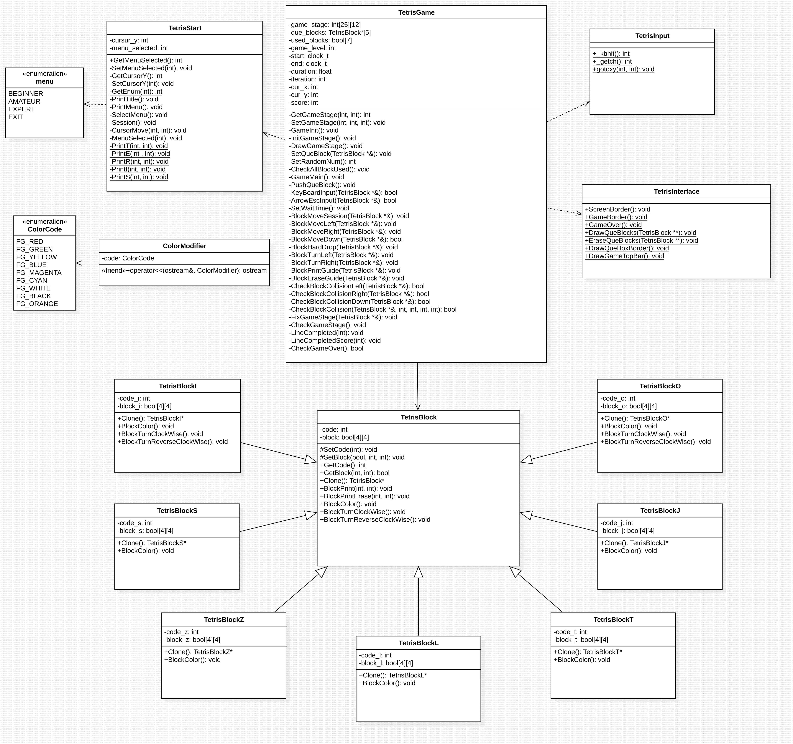

# Tetris on Linux

## My Desktop Environment

- OS : Arch linux
- DE/WM : Hyprland(Wayland)

## Tools

- C++
- CLion
- CMake
- clang-format

## Naming Conventions

- Variables: 'snake_case'
- Functions: 'CamelCase'
- Classes: 'CamelCase'
- Macros: 'SCREAMING_SNAKE_CASE'
- Constants: 'SCREAMING_SNAKE_CASE'

## Class Diagram (UML)

## Used Linux Only Functions

- Color::ColorModifier();
- termios.h
- sys/select.hs
    - TetrisInput::gotoxy();
    - TetrisInput::_getch();
    - TetrisInput::_kbhit();
- unistd.h
    - usleep();
    - system();
- All Keyboard Input Ascci Codes Logics
    - TetrisInput::getInput();